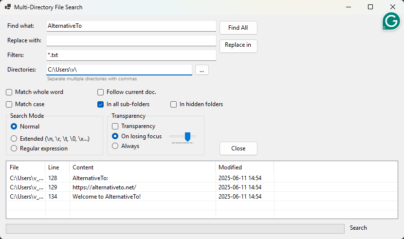

# Screenshots of WinFindGrep

See WinFindGrep in action with these examples, which correspond to the scenarios detailed on our [Usage page](usage.md).

## Example 1: Finding a Specific Function Name

This screenshot shows WinFindGrep configured to find the function `CalculateTotal` in `*.cs` files, as described in [Usage Example 1](usage.md#example-1-finding-a-specific-function-name-in-code-files).

## Example 2: Searching for an Error Message (Case Insensitive)

Here, WinFindGrep is set up to search for "database connection error" in `*.log` files, ignoring case, matching [Usage Example 2](usage.md#example-2-searching-for-an-error-message-in-log-files-case-insensitive).

## Example 3: Finding TODO Comments using Regular Expressions

This example demonstrates a regular expression search for "TODO:" comments across all file types, as detailed in [Usage Example 3](usage.md#example-3-finding-all-todo-comments-using-regular-expressions).

## Example 4: Searching with Extended Mode (Tab Characters)

This screenshot illustrates using WinFindGrep's extended search mode to find lines with specific tab-separated values (`ProductA\tShipped`) in `.tsv` files, corresponding to [Usage Example 4](usage.md#example-4-searching-for-lines-containing-specific-tab-separated-values-extended-mode).

